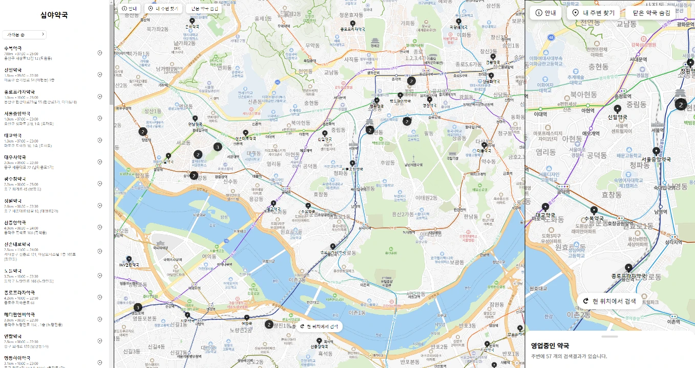

웹사이트 링크: [바로가기](https://getdrug.co)

[](https://getdrug.co/)


# Install

```bash
git clone https://github.com/mode9/pharmacy.git 
cd pharmacy

npm install
# or
yarn install
```


# Development

```bash
npm run dev
# or
yarn dev
```

http://localhost:3000

## Required
- /data_new.json
- /holidays.json
- /.env
    ```
    GOOGLE_CLIENT_ID=
    GOOGLE_CLIENT_SECRET=
    NAVER_KEY=
    NODE_ENV=
    AUTH_KEY=
    ```


# Deployment

```bash
npm run build
# or
yarn build

sudo pm2 start npm -- start 
```
